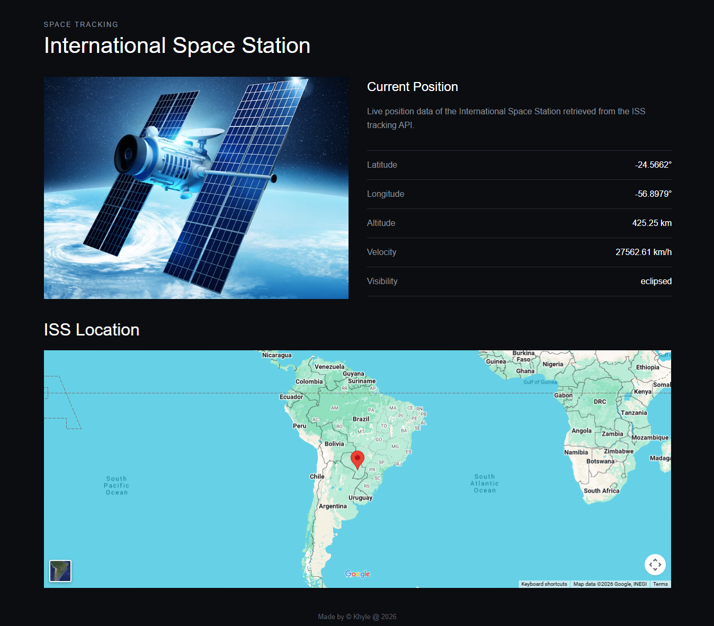
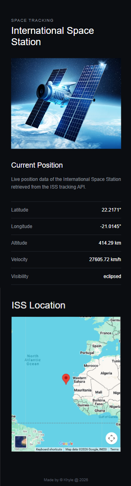

# Satellite Tracking Project

I built this project to practice working with APIs using Node.js and Express.

The website gets live information about the International Space Station from the Where The ISS At API and displays its current location and other tracking information. I also added Google Maps using the latitude and longitude from the API to show where the ISS is currently located.

## Features

The website displays:

- Latitude
- Longitude
- Altitude
- Velocity
- Visibility
- Current ISS location on Google Maps

## Screenshots

### Desktop


### Mobile


## Technologies Used

- Node.js
- Express.js
- EJS
- HTML
- CSS
- Fetch API
- Google Maps
- Where The ISS At API

## What I Learned

While making this project, I practiced:

- Making API requests using `fetch()`
- Working with API response data
- Passing data from Express to EJS
- Displaying dynamic data with EJS
- Handling errors from API requests
- Using latitude and longitude with Google Maps
- Making the page responsive

## API

This project uses the Where The ISS At API:

`https://api.wheretheiss.at/v1/satellites/25544`

## How to Run

Install the dependencies and start the server:

```bash
npm install
npm start
```

Then open http://localhost:3000 in your browser.

Made by Khyle