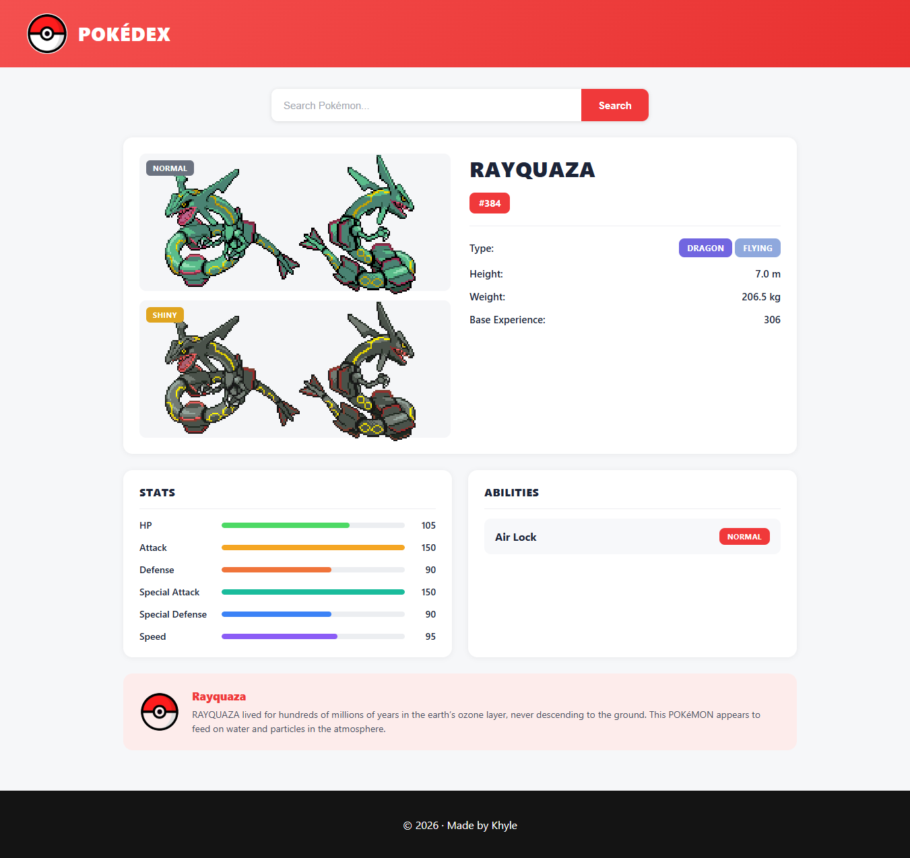
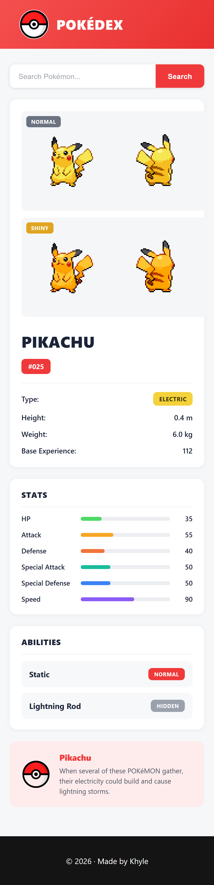

# Pokémon Search Project

I built this project to practice working with APIs using Node.js, Express, and EJS.

The website uses the PokéAPI to retrieve Pokémon information and displays the selected Pokémon along with its sprite, types, stats, abilities, and description. Users can search for a Pokémon by name using the search form.

## Features

The website displays:

* Pokémon name
* Pokémon sprite
* Pokémon types
* Pokémon abilities
* Pokémon stats
* Pokémon description
* Pokémon search

## Screenshots

### Desktop



### Mobile



## Technologies Used

* Node.js
* Express.js
* EJS
* HTML
* CSS
* Axios
* PokéAPI

## What I Learned

While making this project, I practiced:

* Making API requests using Axios
* Working with API response data
* Using multiple API endpoints
* Passing data from Express to EJS
* Displaying dynamic data with EJS
* Working with nested API data
* Handling errors from API requests
* Creating a Pokémon search feature
* Making the page responsive

## API

This project uses the [PokéAPI](https://pokeapi.co/).

## How to Run

Install the dependencies:

```bash
npm install
```

Start the server:

```bash
npm start
```

Then open:

```text
http://localhost:3000
```

Made by Khyle
